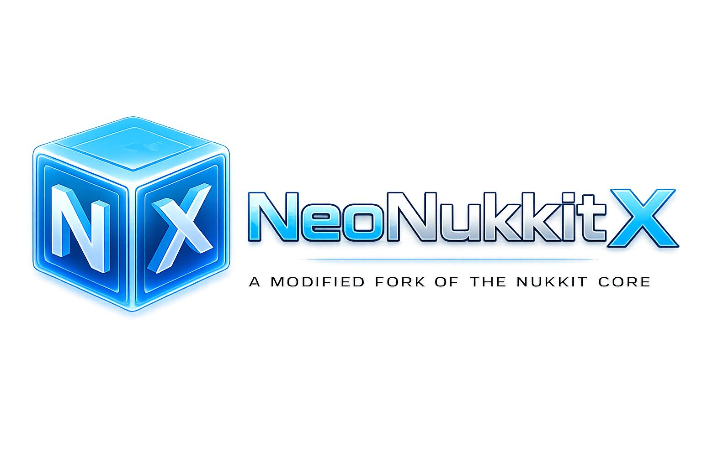

<p align="center">
  
</p>

<h1 align="center">NeoNukkitX Core</h1>

<p align="center">
  <strong>Modern Minecraft: Bedrock Edition Server Software</strong>
</p>

<p align="center">
  <a href="#-base-specifications"></a>
  <a href="#-base-specifications"></a>
  <a href="#-project-stats"></a>
  <a href="#-branding--identity"></a>
  <a href="#-license"></a>
  <a href="#-project-stats"></a>
</p>

<br/>

<div align="center">

<table>
<tr>
<td>

<div style="background-color:#d4edda; border:2px solid #28a745; border-radius:16px; padding:18px 26px; color:#155724; max-width:640px; text-align:left;">
  <strong>✅ Partial Compatibility</strong><br/><br/>
  Plugins written for <strong>PowerNukkitX</strong> and <strong>Nukkit</strong> itself may be compatible with <strong>NeoNukkitX</strong>.
</div>

</td>
</tr>
</table>

<br/>

<table>
<tr>
<td>

<div style="background-color:#f8d7da; border:2px solid #dc3545; border-radius:16px; padding:18px 26px; color:#721c24; max-width:640px; text-align:left;">
  <strong>❌ Incompatible</strong><br/><br/>
  Plugins from <strong>PocketMine-MP (PMMP)</strong> and its forks are <strong>completely incompatible</strong> and will <strong>not work</strong>.
</div>

</td>
</tr>
</table>

<br/>

<table>
<tr>
<td>

<div style="background-color:#fff3cd; border:2px solid #ffc107; border-radius:16px; padding:18px 26px; color:#856404; max-width:640px; text-align:left;">
  <strong>⚠️ Warning</strong><br/><br/>
  On <strong>old or weak servers</strong>, the core may log warnings during <strong>chunk rendering</strong> and <strong>chunk generation</strong>. This issue will be <strong>fixed in the next update</strong>.
</div>

</td>
</tr>
</table>

</div>

<br/>

## 🔗 Quick Links

<p align="center">
  <a href="#-overview">📖 Overview</a> &nbsp;•&nbsp;
  <a href="#-base-specifications">⚙️ Specifications</a> &nbsp;•&nbsp;
  <a href="#-branding--identity">🎨 Branding</a> &nbsp;•&nbsp;
  <a href="#-bug-fixes-from-original-nukkit">🐛 Bug Fixes</a> &nbsp;•&nbsp;
  <a href="#-core-commands">🎮 Commands</a> &nbsp;•&nbsp;
  <a href="#-entity-ai-system">🧠 AI System</a> &nbsp;•&nbsp;
  <a href="#-custom-mob--sulfur-cube">🟡 Sulfur Cube</a> &nbsp;•&nbsp;
  <a href="#-natural-spawn-system">🌱 Mob Spawner</a> &nbsp;•&nbsp;
  <a href="#-optimizations">🚀 Optimizations</a> &nbsp;•&nbsp;
  <a href="#-world-generation">🌍 World Gen</a> &nbsp;•&nbsp;
  <a href="#-new-world-populators">🗺 Populators</a> &nbsp;•&nbsp;
  <a href="#-internal-modules">🛡 Modules</a> &nbsp;•&nbsp;
  <a href="#-project-stats">📊 Stats</a> &nbsp;•&nbsp;
  <a href="#-architectural-rules">🏛 Architecture</a> &nbsp;•&nbsp;
  <a href="#-building-from-source">🔨 Build</a>
</p>

---

## ⚠️ Compatibility Notice

NeoNukkitX is a **standalone server core** with a fully separate plugin API. Compatibility with existing plugin ecosystems is as follows:

- ✅ **PowerNukkitX** and **Nukkit** plugins — *may* be compatible (the API surface is close).
- ❌ **PocketMine-MP (PMMP)** and its forks — **not compatible**, plugins will **not work**.

The core uses an entirely separate `rusplugins.neonukkitx` namespace and ships its own plugin API (`v1.1.0`).

---

## 📑 Table of Contents

- [Overview](#-overview)
- [Base Specifications](#-base-specifications)
- [Branding & Identity](#-branding--identity)
- [Infrastructure Changes](#-infrastructure-changes)
- [Bug Fixes](#-bug-fixes-from-original-nukkit)
- [Core Commands](#-core-commands)
- [Entity AI System](#-entity-ai-system)
- [Custom Mob — Sulfur Cube](#-custom-mob--sulfur-cube)
- [Natural Spawn System](#-natural-spawn-system)
- [Optimizations](#-optimizations)
- [World Generation](#-world-generation)
- [New World Populators](#-new-world-populators)
- [Launch Scripts](#-launch-scripts)
- [Internal Modules](#-internal-modules)
- [Project Stats](#-project-stats)
- [Architectural Rules](#-architectural-rules)
- [Building from Source](#-building-from-source)
- [License](#-license)

---

## 🧭 Overview

NeoNukkitX is a private Minecraft Bedrock Edition server core written in Java 21. It is a complete rebrand and refactor of the original Nukkit project under the new identity `NeoNukkitX` with a fully new namespace (`rusplugins.neonukkitx`). The core is built with production-grade optimizations, custom world generation, an Entity AI state machine, and a built-in security suite.

---

## ⚙️ Base Specifications

| Parameter         | Value                                                       |
|-------------------|-------------------------------------------------------------|
| Language          | Java 21                                                     |
| Build System      | Gradle 8.5                                                  |
| Build Plugin      | ShadowJar                                                   |
| Version Control   | Git Version Integration                                     |
| JVM Flags         | `--add-opens`, G1GC, CompressedOops, UseStringDeduplication |
| Compression       | Snappy (Level 7)                                            |
| Network Stack     | Netty (pooled allocator, leak detection OFF)                |
| Garbage Collector | G1GC (Max Pause 100ms, DisableExplicitGC)                   |

---

## 🎨 Branding & Identity

| Attribute        | Value                              |
|------------------|------------------------------------|
| Name             | Nukkit → **NeoNukkitX**            |
| Main Class       | `rusplugins.neonukkitx.NeoNukkitX` |
| Namespace        | `rusplugins.neonukkitx.*`          |
| Old Namespace    | `cn.nukkit.*` (fully removed)      |
| Maven `groupId`  | `rusplugins.neonukkitx`            |
| Core Version     | `1.0.0.0`                          |
| Plugin API       | `1.1.0`                            |
| Config File      | `neonukkitx.yml`                   |
| ASCII Logo       | New                                |
| Sub-MOTD         | New                                |
| Language Keys    | New                                |
| Tagline          | *"Nuclear powered server software"* |

---

## 🛠 Infrastructure Changes

- ✅ Upgraded to **Java 21**
- ✅ Migrated to **Gradle 8.5**
- ✅ Adopted **ShadowJar** for fat-jar packaging
- ✅ Integrated **Git Version Integration** (build version reflects commit state)
- ✅ Added JVM **`--add-opens`** flags for modern module access
- ✅ Fully replaced `cn.nukkit.*` with `rusplugins.neonukkitx.*`

---

## 🐛 Bug Fixes (from original Nukkit)

| Bug                                          | Status              |
|----------------------------------------------|---------------------|
| `/tps` command broken                        | ✅ Fixed            |
| Pre-loading of startup chunks                | ✅ Fixed            |
| Persistent player UUIDs                      | ✅ Fixed            |
| Cover blocks appearing above water           | ✅ Fixed            |
| Mountain generation                          | ✅ Fixed            |
| Creeper explosion delay                      | ✅ Added (30 ticks) |

---

## 🎮 Core Commands

| Command              | Description                          |
|----------------------|--------------------------------------|
| `/version` / `/ver`  | Show server / core information       |
| `/tps`               | Show current server TPS              |
| `/ping`              | Show server ping                     |
| `/plugins` / `/pl`   | List plugins and internal modules    |

---

## 🧠 Entity AI System

A custom-built AI state machine attached to every `EntityLiving` (except players).

### Supported States

| State     | Tick Rate | Description                            |
|-----------|-----------|----------------------------------------|
| `IDLE`    | 20 ticks  | Standing still                         |
| `WANDER`  | 5 ticks   | Roaming within an 8-block radius       |
| `CHASE`   | 1 tick    | Pursuing the nearest target            |
| `ATTACK`  | —         | Performing an attack action            |
| `FLEE`    | —         | Retreating from a threat               |

### Highlights

- 🧊 AI **sleeps** when no player is within **48 blocks** — saving CPU.
- 🎯 **Nearest-player cache** — no per-tick scans of all players.
- ⏱ **Dynamic tick rate per state** — idle mobs cost almost nothing.
- 🌍 `WANDER` is hard-capped to an **8-block radius** from spawn position.
- 🚫 Players are excluded — AI never auto-attaches to a `Player`.

---

## 🟡 Custom Mob — Sulfur Cube

| Parameter    | Value                  |
|--------------|------------------------|
| `NETWORK_ID` | `153`                  |
| Type         | `CustomEntity`         |
| Drops        | `ItemSulfur` (ID `851`)|
| Status       | Fully registered       |

---

## 🌱 Natural Spawn System (`MobSpawnerTask`)

| Setting           | Value                          |
|-------------------|--------------------------------|
| Run interval      | Every **10 seconds**           |
| Daytime spawns    | Passive mobs                   |
| Nighttime spawns  | Hostile mobs                   |
| Spawn radius      | **16–48 blocks** from a player |
| Per-player cap    | **12 mobs**                    |
| World cap         | **80 mobs**                    |

---

## 🚀 Optimizations

### CPU
- AI sleeps beyond 48 blocks
- Nearest-player cache
- Chunk Tick Radius: `2`
- Chunks Per Tick: `20`

### RAM
- Autosave every `12000` ticks
- `UseStringDeduplication` enabled
- `CompressedOops` enabled

### Disk
- Max **8 chunks** saved per tick

### Network
- Snappy Compression (Level 7)
- Netty pooled allocator
- Leak Detection: **OFF**

### JVM
- G1GC, Max Pause `100ms`
- `DisableExplicitGC`

---

## 🌍 World Generation

### Modified Biomes

- `CoveredBiome`
- `SnowyBiome`
- `ExtremeHillsBiome`
- `ExtremeHillsPlusBiome`
- `ForestBiome`
- `PlainsBiome`

### Generation Improvements

- ❄️ Snow on high-altitude mountains
- 🧗 Vertical cliffs
- ⛰ Taller, more dramatic peaks
- 🌲 Denser forests
- 🌾 Improved plains
- 🧩 New cover system: `getCoverId(x, y, z)`

---

## 🗺 New World Populators

### Water / Shore

| Populator            | Description  |
|----------------------|--------------|
| `PopulatorBeach`     | Beaches      |
| `PopulatorLake`      | Lakes        |
| `PopulatorRiver`     | Rivers       |
| `PopulatorWaterfall` | Waterfalls   |
| `PopulatorRavine`    | Ravines      |

### Land

| Populator           | Description |
|---------------------|-------------|
| `PopulatorCrater`   | Craters     |
| `PopulatorVolcano`  | Volcanoes   |

### Ocean

| Populator                | Description        |
|--------------------------|--------------------|
| `PopulatorOceanFloor`    | Ocean floor        |
| `PopulatorUnderwaterCave`| Underwater caves   |
| `PopulatorCoral`         | Coral reefs        |
| `PopulatorOceanRuin`     | Ocean ruins        |
| `PopulatorKelp`          | Kelp               |

---

## 📜 Launch Scripts

- `start.sh` — fully optimized launch script with all required JVM flags, G1GC tuning, Netty, and Snappy settings pre-applied.

---

## 🛡 Internal Modules

NeoNukkitX ships its own internal modules under the core itself.

### NeoNukkitX-Core

| Field    | Value                                |
|----------|--------------------------------------|
| Type     | Internal core module                 |
| Role     | Core liveness indicator (heartbeat)  |
| Version  | `1.0.0.0`                            |
| Author   | NeoNukkitX Team                      |

### NEONKX-Internal

| Field    | Value                          |
|----------|--------------------------------|
| Type     | Internal core module           |
| Version  | `1.0.0.0`                      |
| Purpose  | Built-in server protection suite |

#### Protection Subsystems

- 🛡 **Anti-DDoS System** — DDoS attack mitigation
- 🤖 **Anti-Bot System** — bot connection filtering
- 🪑 **Anti-AFK System** — AFK exploit protection
- 🚫 **Anti-Cheat System** — cheat detection
- 💥 **Anti-Brake System** — server-brake protection
- 📦 **Anti-Dupe System** — duplication exploit prevention

---

## 📊 Project Stats

| Metric                                          | Value                  |
|-------------------------------------------------|------------------------|
| Core Version                                    | `1.0.0.0`              |
| Plugin API                                      | `1.1.0`                |
| Status                                          | **Stable**             |
| Total major changes (vs. original Nukkit)       | **73**                 |
| Current focus                                   | World generation improvements |

---

## 🏛 Architectural Rules

These rules are non-negotiable in the NeoNukkitX codebase:

- ❌ **`cn.nukkit.*` is forbidden** — fully removed.
- ❌ **No plugin development in this repository** — core only.
- ❌ **No compatibility with PocketMine / PMMP / EndStone / LeviLamina / Bukkit / Spigot / Paper.**
- ⚠️ **No active compatibility work for Nukkit / NukkitX / PowerNukkit** — they *may* work if the API surface matches, but no guarantees and no shims are shipped.
- ✅ **All decisions must follow the NeoNukkitX architecture.**
- ✅ **Minimal, safe changes** — surgical refactors only.
- ✅ **Production-level code quality.**
- ✅ **CPU and RAM optimization** at every level.

---

## 🔨 Building from Source

```bash
# Clone the repository
git clone https://github.com/RUSPlugins-Team/NeoNukkitX.git
git clone https://github.com/NeoNukkitX-Intertainment/NeoNukkitX.git

cd NeoNukkitX

# Build the fat jar (via Gradle + ShadowJar)
./gradlew shadowJar

# Run the server
java -jar build/libs/NeoNukkitX-1.0.0.0.jar
```

The default Gradle target produces a fully shaded `*.jar` in `build/libs/`.

---

## 📄 License

This project is licensed under the **GNU Lesser General Public License v3.0 (LGPL-3.0)** — see the [LICENSE](LICENSE) file for details.

---

## 🏢 Ownership & Credits

### NeoNukkitX Core

NeoNukkitX is owned, developed, and maintained by:

- **🏢 [[NeoNukkitX-Intertainment]([https://github.com/NeoNukkitX-Intertainment)**
- **🏛️ [RUSPlugins-Team LLC](https://github.com/RUSPlugins-Team)**

### Original Nukkit — Acknowledgments

NeoNukkitX was originally derived from the Nukkit project. The original creators and maintainers of Nukkit are credited below:

| Role                        | Credit                                          |
|-----------------------------|-------------------------------------------------|
| Original Creator of Nukkit  | **MagicDroidX**                                 |
| Long-term Project Host      | **CloudburstMC** (`cloudburstmc/Nukkit`)        |
| NukkitX Lineage             | **CreeperFace** & contributors                  |
| PowerNukkit Lineage         | PowerNukkit / PowerNukkitX maintainers          |

We acknowledge and thank the original Nukkit authors and contributors whose work made this project possible.

### A Note on Forks

> **NeoNukkitX is a heavily modified and rearchitected server core — it is not a typical fork.**

While NeoNukkitX originated from Nukkit, virtually every layer has been rewritten:
- The entire namespace has been replaced (`cn.nukkit.*` → `rusplugins.neonukkitx.*`).
- The build system, Entity AI, world generation, and protection subsystems are original work.
- It is published and maintained as a **standalone product** under **NeoNukkit Team LLC** and **RUSPlugins-Team LLC**, with its own plugin API (`v1.1.0`), branding, and roadmap.

As a result, NeoNukkitX should be regarded as a **modified core** — not as a downstream fork of any existing project.

---

<p align="center"><sub>Built with ☢️ by the NeoNukkitX Team — Nuclear powered server software.</sub></p>
